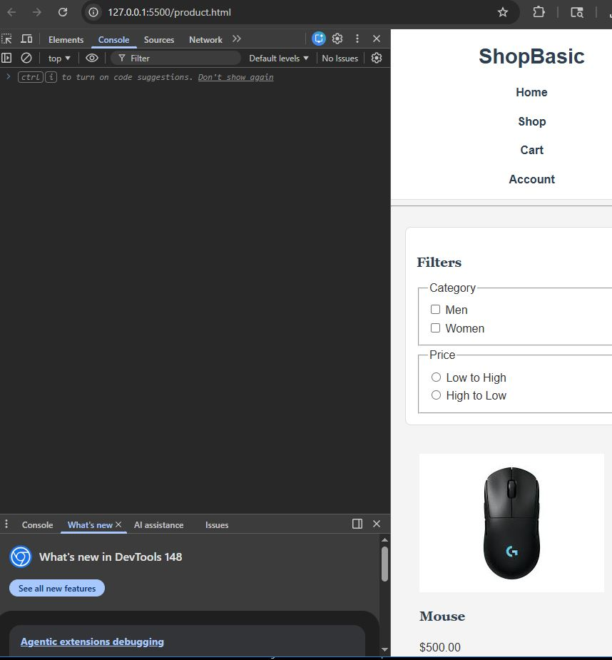

ShopBasic Ecommerce API

## 📌 Project Overview
This is a RESTful API built using Spring Boot that manages an e-commerce product catalog. It supports full CRUD operations, filtering, and secure cross-origin resource sharing (CORS) to serve a dynamic vanilla JavaScript frontend. Data is persisted using a relational database via Spring Data JPA. The application is secured using Spring Security with session-based authentication and CSRF protection.

---

## 🚀 How to Run the Project

1. Open terminal in the project folder
2. Run the Spring Boot server:
   ```bash
   ./gradlew bootRun
The server runs at: http://localhost:8080


---

## 📦 Tech Stack
- Spring Boot
- Java
- Gradle
- In-memory List storage

---

## 🔗 API Endpoints

### GET all products

GET /api/v1/products


### GET product by ID

GET /api/v1/products/{id}


### CREATE product

POST /api/v1/products


### UPDATE product (PUT)

PUT /api/v1/products/{id}


### PARTIAL UPDATE (PATCH)

PATCH /api/v1/products/{id}


### DELETE product

DELETE /api/v1/products/{id}


### FILTER products

GET /api/v1/products/filter?filterType=category&filterValue=Category 1


---

## ⚠️ Notes
- Uses in-memory storage (List<Product>)
- Data resets when server restarts

---

## 📸 Testing Proof
All endpoints tested using Thunder Client / Postman.


## Database Schema
* **Product:** Contains fields for id, name, description, price, imageUrl, and a Many-To-One relationship with Category.
* **Category:** Contains fields for id, name, and a One-To-Many relationship with Products.

## API Endpoints
* `GET /api/v1/products` - Fetches all products.
* `GET /api/v1/products/{id}` - Fetches a single product by ID.
* `POST /api/v1/products` - Creates a new product.

## Lab Integration Proof
**Successful API Fetch & Console:**


**Database Table Population:**
